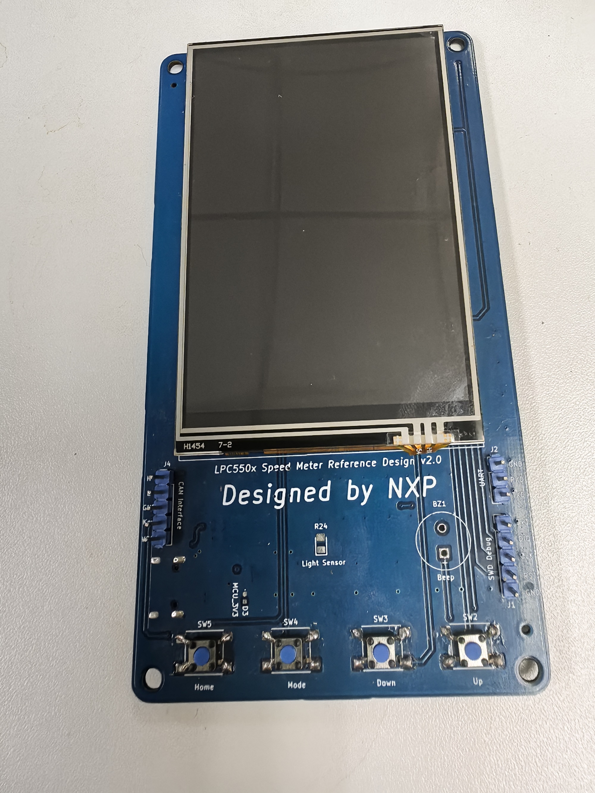
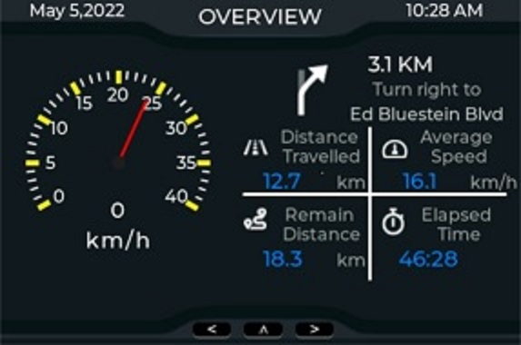
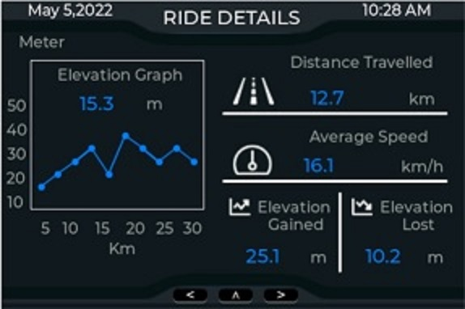
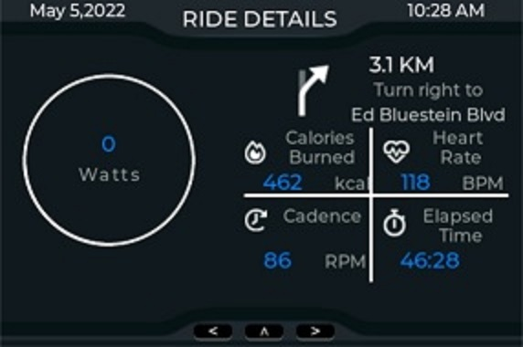

# NXP Application Code Hub

## AN13730：How to Develop LVGL GUI Demo on Memory-constrained MCU with GUI Guider
An attractive GUI is reliant upon well designed images and fonts. The more complex the GUI demo is, the more of these assets are required, leading to greater memory resources being consumed. If the MCU selected for a design does not have abundant on-chip Flash and on-chip RAM to store images and fonts, it means that you have to use off-chip Flash and off-chip RAM.

Fortunately, LVGL provides file system mechanism to support external storage device like SD card or serial Flash. This application note uses LPC55S06 as the target MCU. It takes the implementation of an E-Bike UI as an example to introduce how to use the LVGL file system to support a low-cost external serial Flash. The external serial flash used in this application note is a Winbond W25Q64. 

In addition to providing graphic functionality, LVGL supports an input device mechanism. This application note introduces how to use hardware buttons as LVGL input devices to achieve screen switching.

Please refer to AN13730 for complete instructions on how to use this software.

https://www.nxp.com.cn/docs/en/application-note/AN13730.pdf

#### Boards: LPC550x Speed Meter Reference Resign
#### Categories: Graphics
#### Peripherals: DISPLAY
#### Toolchains: MDK

## Table of Contents
1. [Software](#step1)
2. [Hardware](#step2)
3. [Setup](#step3)
4. [Results](#step4)
5. [FAQs](#step5) 
6. [Support](#step6)
7. [Release Notes](#step7)

## 1. Software

​       1. Development Environment:

​       SDK:2.10.1

​       GUI Guider: 1.3.1-GA

​       LVGL: 8.0.2

​       Keil IDE:5.35.0.2

   2. Application Software

      The software for this Application Note is delivered in raw source files and MDK projects.

## 2. Hardware

This board is a customized evaluation board specifically designed for EBike demo, named as LPC550x Speed Meter reference design. The current version is v2.0.

</img>

## 3. Setup

 1. power up the board through J3. J3 is a USB Type-C connector and is installed on the bottom size of the board.
 1. Compile the software project and download the executable file to the board through J1 connector.
 1. Download the image source and font source(if you use font) to the external SPI Flash.
 1. Reset the board
 1. Press the Home button to return Home page, press the Down button to switch to the next GUI page and press the Up button to switch to the previous GUI page

## 4. Results

  When this demo board is powered-up or reset, the demo will show the home UI page.

</img>

When you press the Down button, you will see the this UI page.

</img>

When you press the Down button, you will see the this page.

</img>

when you continue to press the Down button,the demo will return to the home UI page.

if you switch the UI page by clicking Up button, the demo will display these UI pages  in reverse order.

## 5. FAQs

  If you have some question, you can contact FAE or create a ticket to NXP community.

## 6. Support

The details for this demo are all recorded in the application note - AN13730 How to Develop LVGL GUI Demo on Memory-constrained MCU with GUI Guider.

If you need help, please contact FAE or create a ticket to [NXP Community](https://community.nxp.com/).

#### Project Metadata
<!----- Boards ----->

<!----- Categories ----->

<!----- Peripherals ----->

<!----- Toolchains ----->

Questions regarding the content/correctness of this example can be entered as Issues within this GitHub repository.

>**Warning**: For more general technical questions regarding NXP Microcontrollers and the difference in expected funcionality, enter your questions on the [NXP Community Forum](https://community.nxp.com/)

## 7. Release Notes
| Version | Description / Update                           | Date                        |
|:-------:|------------------------------------------------|----------------------------:|
| 1.0     | Initial release on Application Code HUb        | June 6th 2023 |

